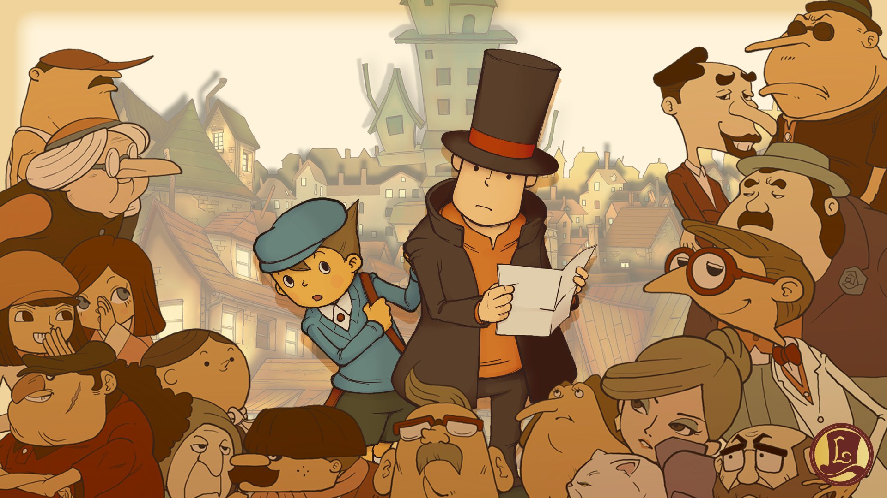
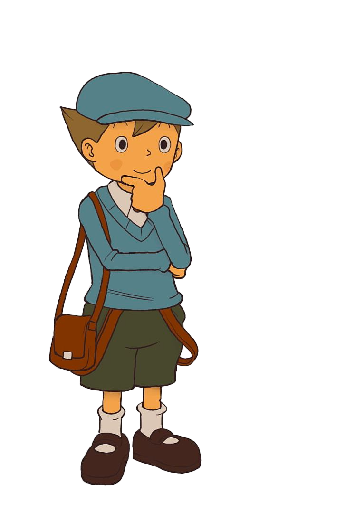
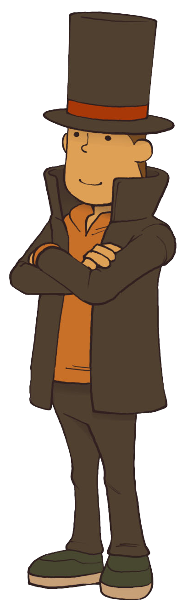

  

<h1 align="center">
  Professor Layton and the Curious Village
</h1>

<h align="center">
This project was made to find the best solution in a series of puzzles in the game "Professor Layton and the Curious Village"
</h3>

  

  
  

| Puzzle | Program |
| ------ | ------ |
| **023** Juice Pitchers | [Crouton's Pitchers][Pitchers] |
| **024** Milk Pitchers | [Crouton's Pitchers][Pitchers] |
| **078** Water Pitchers | [Crouton's Pitchers][Pitchers] |
| **080** Too Many Queens 1 | Coming soon |
| **081** Too Many Queens 2 | Coming soon |
| **082** Too Many Queens 3 | Coming soon |
| **083** Too Many Queens 4 | Coming soon |

[Pitchers]: <https://github.com/Ocarina588/Professor_Layton_CV--Croutons_Pitchers/tree/main/Croutons_Pitchers>

