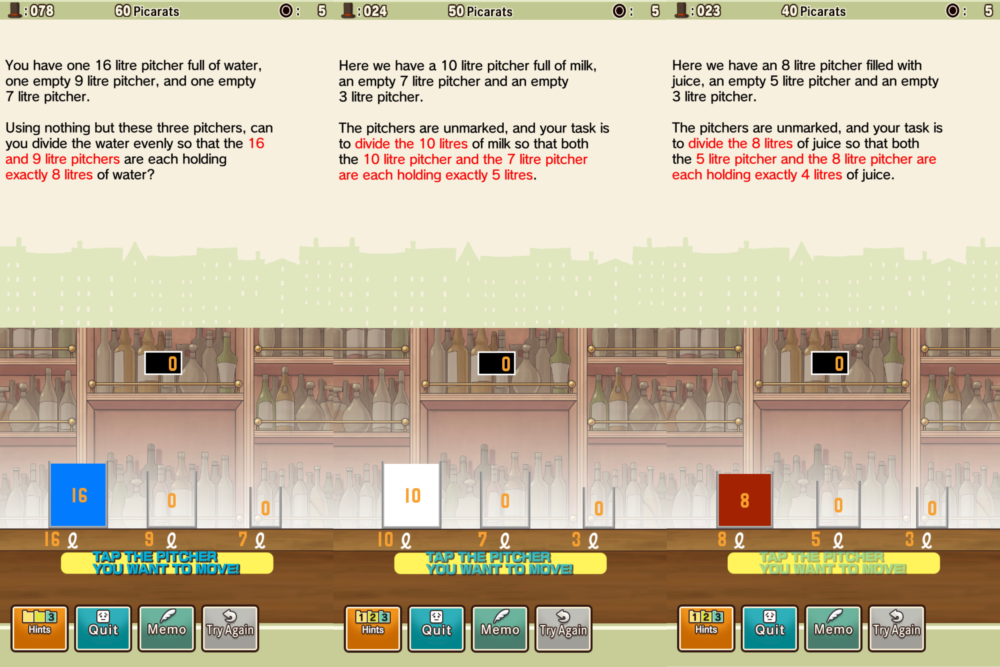

<p align="center">
  
</p>

<h1 align="center">
  Professor Layton and the Curious Village
</h1>
<h1 align="center">
  Crouton's Pitchers
</h1>

This project was made to find the best solution in a series of puzzles in the game "Professor Layton and the Curious Village"

# Puzzles

- 023 Juice Pitchers
- 024 Milk Pitchers
- 078 Water Pitchers

<p align="center">
  
</p>

# Usage

```
Croutons_pitchers x0 x1 x2 y0 y1 y2
```

The binary takes 6 arguments ->

- x0 x1 x2 are integers representing the capacity in litres of pitcher 0, 1 and 2
- y0 y1 y2 are integers representing the amount of litres wanted at the end in pitcher 0, 1 and 2


# Exemple

Here's an exemple to solve "Water Pitchers"
```
Croutons_pitchers 16 9 7 8 8 0
```

```
The steps are:
0 > 1
1 > 2
2 > 0
1 > 2
0 > 1
1 > 2
2 > 0
1 > 2
0 > 1
1 > 2
2 > 0
1 > 2
0 > 1
1 > 2
2 > 0
```